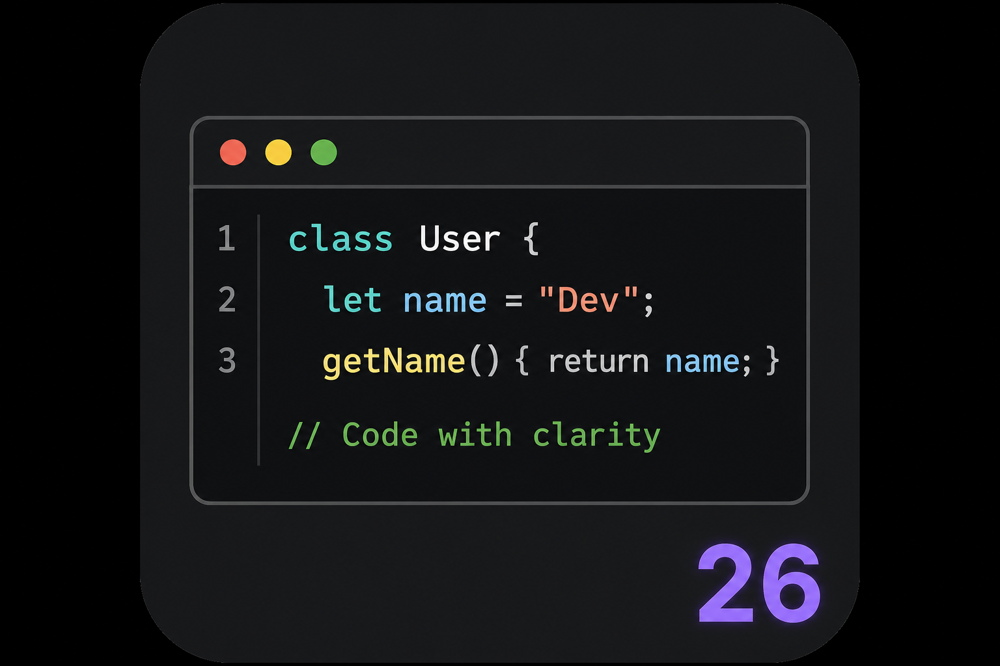

# Dark Theme VS2026

Тёмная тема для [Cursor](https://cursor.com) и [Visual Studio Code](https://code.visualstudio.com) с подсветкой синтаксиса в стиле **Visual Studio 2026** и нативным интерфейсом **Cursor Dark**.



## Особенности

- **Подсветка синтаксиса VS2026** — цвета ключевых слов, типов, функций, строк и комментариев как в Visual Studio.
- **Интерфейс Cursor** — панели, вкладки, боковая панель и терминал наследуются от встроенной темы Cursor Dark, без «чужого» оформления VS Code.
- **Семантическая подсветка** — поддержка LSP-семантики для C#, C/C++ и других языков.
- **Широкая поддержка языков** — отдельные правила для C, C++, C#, Go, Java, Python, HTML, XML, JSON, Shell, CMake и др.

## Палитра

| Элемент | Цвет |
| --- | --- |
| Текст | `#DCDCDC` |
| Комментарии | `#57A64A` |
| Строки | `#D69D85` |
| Ключевые слова | `#569CD6` |
| Управляющие конструкции (C#) | `#D8A0DF` |
| Типы / классы | `#4EC9B0` |
| Интерфейсы / enum | `#B8D7A3` |
| Функции / методы | `#DCDCAA` |
| Переменные | `#9CDCFE` |
| Числа | `#B5CEA8` |

## Установка

### Из Marketplace

1. Откройте панель расширений (`Ctrl+Shift+X`).
2. Найдите **Dark Theme VS2026**.
3. Нажмите **Install**.

### Из исходников

```bash
git clone https://github.com/ZTex275/cursor-dark-theme-vs2026.git
cd cursor-dark-theme-vs2026
```

В Cursor / VS Code: **Extensions** → `...` → **Install from VSIX...** (после сборки, см. ниже)  
или откройте папку расширения в режиме разработки (**Run Extension**).

### Сборка VSIX

```bash
npm install -g @vscode/vsce
vsce package
```

Установите полученный `.vsix` через **Install from VSIX...**.

## Активация

1. `Ctrl+K`, затем `Ctrl+T` (или **File → Preferences → Theme → Color Theme**).
2. Выберите **Visual Studio 2026 Dark**.

После обновления темы перезагрузите окно: **Developer: Reload Window**.

## Как устроена тема

Тема состоит из двух частей:

| Файл | Назначение |
| --- | --- |
| `themes/base/cursor-workbench.json` | Цвета интерфейса Cursor (панели, меню, вкладки и т.д.) |
| `themes/dark-color-theme.json` | Подсветка синтаксиса VS2026 (`tokenColors`, `semanticTokenColors`) |

Такой подход даёт привычные цвета кода из Visual Studio без замены оформления редактора Cursor.

## Требования

- Cursor или Visual Studio Code **1.85.0** и новее

## Лицензия

MIT

## Автор

**ZTex275** — [airflow275@gmail.com](mailto:airflow275@gmail.com)

Основано на теме [vscode-dark-theme-vs2022](https://github.com/SoVoKaN/vscode-dark-theme-vs2022) от SoVoKaN.
